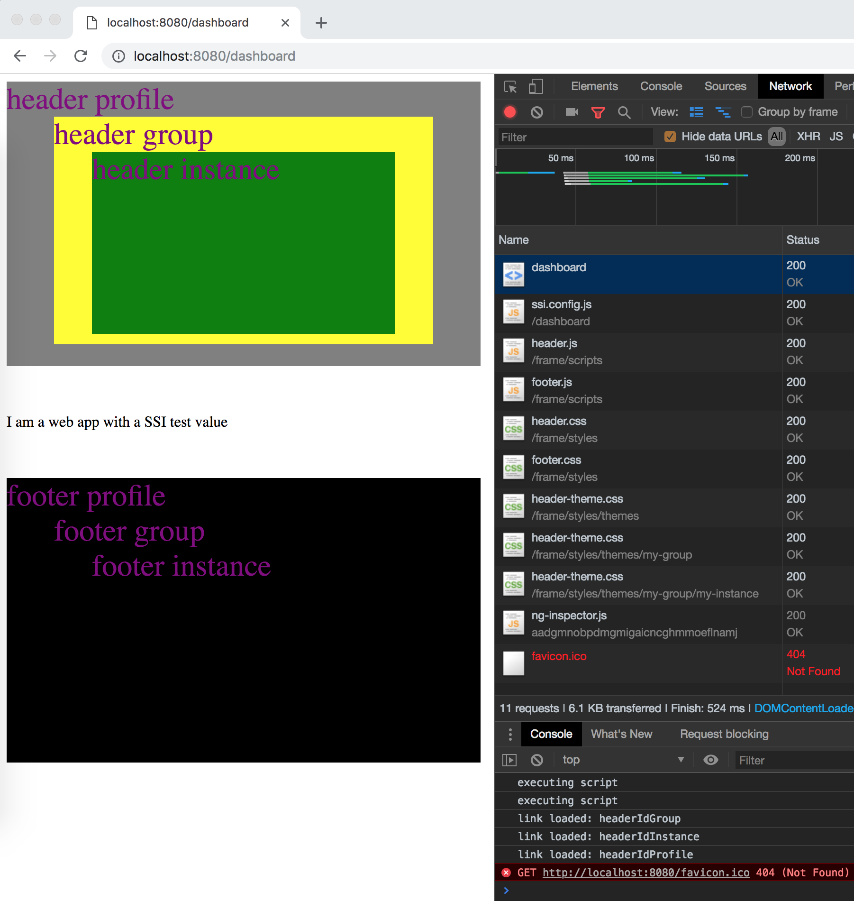

# Nginx SSI Development Environment

## Start nginx

```
cd ~/nginx-ssi-dev-environment
make run-nginx
```

On any file changes, simply restart the container (`cmd+c` and `make run-nginx` again).

## Debugging

In another shell you can follow debug messages:

```
cd ~/nginx-ssi-dev-environment
make debug
```

## Testing

In another shell you can test the current configuration:

```
cd ~/nginx-ssi-dev-environment
make test
```

### Test Expectations

Here an onelinter to check your test expectations:

```
cd ~/nginx-ssi-dev-environment
TEST_CASES_TO_MATCH=8 result=$(make test | grep 'Test OK' | wc -l | tr -d " "); if [ "$result" -eq $TEST_CASES_TO_MATCH ]; then echo "Test count OK"; else echo "Test count not expected\!"; fi
```

## Screenshot of current state



## What this project is about

These days it is all about microserivces! And fat SPA frontend monoliths... What can we do about it? Divide and conquer, of course. Some interesting discussions and repos you can find here:

- https://scs-commerce.github.io/
- https://crimson-portal.herokuapp.com/
- https://github.com/ewolff/crimson-assurance-demo
- https://github.com/ewolff/SCS-ESI
- https://github.com/ewolff/SCS-jQuery
- https://dev.otto.de/2014/07/29/scaling-with-microservices-and-vertical-decomposition/
- https://dev.otto.de/2016/03/20/why-microservices/
- https://micro-frontends.org/

## Nginx Docs

- https://www.nginx.com/resources/wiki/start/topics/depth/ifisevil/
- https://www.nginx.com/resources/wiki/start/topics/tutorials/config_pitfalls/
- https://www.nginx.com/resources/wiki/start/topics/examples/dynamic_ssi/
- https://nginx.org/en/docs/http/ngx_http_ssi_module.html
- https://nginx.org/en/docs/http/request_processing.html
- https://www.digitalocean.com/community/tutorials/understanding-nginx-server-and-location-block-selection-algorithms
- https://docs.nginx.com/nginx/admin-guide/web-server/
- https://docs.nginx.com/nginx/admin-guide/web-server/web-server/#configuring-locations
- https://docs.nginx.com/nginx/admin-guide/web-server/serving-static-content/
- https://docs.nginx.com/nginx/admin-guide/web-server/reverse-proxy/
- https://www.nginx.com/blog/performance-tuning-tips-tricks/
